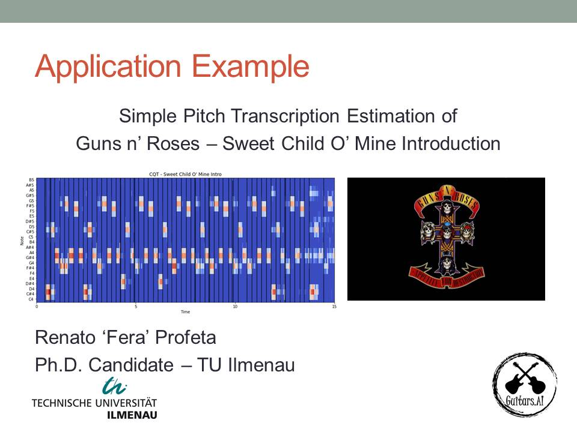

# Step by Step Solution of an Automatic Music Transcription Problem: Transcribing the Guitar Introduction of Guns n' Roses - Sweet Child O' Mine

**Renato Profeta**, Guitars.AI, Technische Universität Ilmenau  
Homepage: http://www.rptecnologias.com/  
Instagram: https://www.instagram.com/guitars.ai/  
Twitter: https://twitter.com/guitars_ai  
Facebook: https://www.facebook.com/GuitarsAI/  
Linkedin: https://www.linkedin.com/in/renato-profeta-6b678831/  
Youtube: https://www.youtube.com/channel/UCyAyQAu_PTX5h1Ni4q0ShHQ

# Youtube Step by Step Solution Videos - Playlist

https://www.youtube.com/playlist?list=PL6QnpHKwdPYh5OdFSt7kNqIPFEvXJRiUQ  

# Requirements
For the requirements for this project to run, please check the following files at the 'binder' folder:
  - environment.yml
  - postBuild
  
# Librosa Documentation:
Website: https://librosa.github.io/librosa/  

# Music21 Documentation:
Website: http://web.mit.edu/music21/doc   

# MIDIUtil Documentation:
Website: https://midiutil.readthedocs.io/en/1.2.1/  

# MyBinder

Launch Binder to Interact with this notebook in a live environment in the cloud:

# Guitars.AI

 

[www.rptecnologias.com](http://www.rptecnologias.com)
 
guitars.ai@rptecnologias.com

